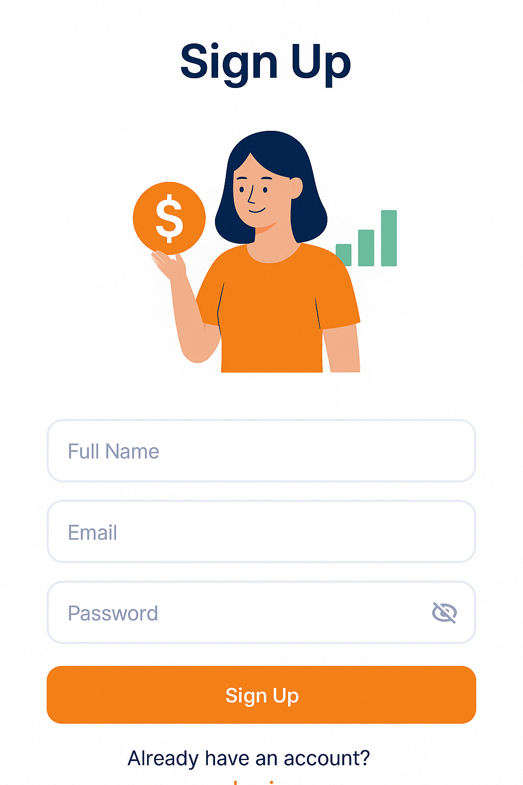

# Personal Finance Tracker (Flutter)

A cross-platform Flutter app (Android/iOS) to manage personal finances using a feature-based architecture: record income/expenses, manage categories, set budgets, and generate visual reports. The app follows Clean Architecture principles, uses Cubit (flutter_bloc) for state management, get_it + injectable for DI, and Supabase as the backend.


## Table of Contents
- Overview & Key Features
- Screenshots (by feature)
- Tech Stack
- Architecture & Data Flow
- Directory Structure
- Routing (go_router)
- Supabase Initialization & Config
- Setup & Running
- Build, Lint, Test, Format
- Code Conventions
- Troubleshooting
- Security Notes
- License


## Overview & Key Features
- Authentication: sign up, sign in (Supabase Auth, PKCE, secure session persistence).
- Dashboard: quick overview of balances and key metrics.
- Transactions: add/edit/delete transactions, history with infinite scrolling.
- Categories: choose categories for income/expense with consistent colors/icons.
- Budgets: set per-category budgets, display and update progress easily.
- Reports: monthly, by category (charts), and summary; ready to extend with PDF/email export.
- Settings: account security and notifications (reminders, budget threshold alerts, tips, etc.).


## Screenshots (by feature)
Each image corresponds to a feature under `lib/features/`.

### 1) Auth (Sign In/Sign Up)
<p>
  
  
</p>

### 2) Dashboard (Overview)
<p>
  
</p>

### 3) Transactions (Add/History)
<p>
  
  
</p>

### 4) Categories (Select/Manage)
<p>
  
</p>

### 5) Budgets (Per category/month)
<p>
  
</p>

### 6) Reports (Summary/By Category)
<p>
  
  
  
</p>

### 7) Settings (Account Security/Notifications)
<p>
  
  
</p>


## Tech Stack
- Flutter (Dart SDK ^3.7.x), Material 3
- State management: flutter_bloc (Cubit), equatable
- Backend: supabase_flutter (Auth, PostgREST, Realtime)
- DI & codegen: get_it, injectable, build_runner
- Charts: fl_chart
- Routing: go_router
- Others: flutter_secure_storage, shared_preferences, intl, month_picker_dialog, flutter_datetime_picker_plus


## Architecture & Data Flow
- Feature-based architecture. Each feature separates state logic (Cubit/State), data (datasource, repository), and UI (view) for maintainability and scalability.
- DI: get_it + injectable. The Supabase module is provided via `RegisterSupabaseModule` to reuse a single `SupabaseClient` across the app.
- Example data flow (Add Transaction):
  1) UI collects input -> calls a method on TransactionCubit.
  2) Cubit delegates to the corresponding Repository/Datasource (Supabase) -> performs I/O.
  3) Result is mapped to State (Loading/Loaded/Error).
  4) UI listens to state, shows messages via NotificationService, and navigates using go_router.

See the database diagram at `docs/database.png` (if available).


## Directory Structure
```
lib/
  features/
    auth/                # sign_in, sign_up, AuthCubit
    dashboard/           # overview screen
    transaction/         # add_transaction, history, TransactionCubit
    category/            # select_category, CategoryCubit
    budget/              # budgeting, BudgetCubit
    report/              # monthly/category/summary, ReportCubit
    settings/            # account_security, notification
  config/
    theme/               # AppTheme, AppColors, AppTypography
    supabase_config.dart # Supabase init (PKCE, auto-refresh token)
    env.dart             # (create locally) Supabase environment variables
  routes/
    app_routes.dart      # GoRouter + BottomNav
  shared/
    services/            # NotificationService
    utils/               # FormatUtils, Validators
    widgets/             # input_text_field, summary_card, ...
  gen/
    assets.gen.dart      # generated by flutter_gen_runner
  app.dart               # MultiBlocProvider, MaterialApp.router
  main.dart              # initSupabase(), configureDependencies()
  injection.dart         # get_it + injectable init
  register_supabase_module.dart
```


## Routing (go_router)
- Main routes: `/signIn`, `/signUp`, `/dashboard`, `/transactions/add`, `/transactionsHistory`, `/report`, `/notifications`, `/settings`, `/report-summary`, `/selectCategory`.
- `ScaffoldWithBottomNav` drives the 6 main tabs: Home (Dashboard), Add, History, Reports, Notifications, Settings.


## Supabase Initialization & Config
- Supabase is initialized in `config/supabase_config.dart`:
```dart
await Supabase.initialize(
  url: supUrl,
  anonKey: supApiKey,
  debug: true,
  authOptions: const FlutterAuthClientOptions(
    autoRefreshToken: true,
    authFlowType: AuthFlowType.pkce,
  ).copyWith(localStorage: SecureSessionStorage()),
);
```
- The app uses PKCE and secure session storage (`SecureSessionStorage`).
- The auth listener is started early in `main.dart` via `getIt<AuthRepository>().initAuthListener()`.

Create a local environment file `lib/config/env.dart` (do not commit secrets):
```dart
const String supUrl = "https://YOUR-PROJECT.supabase.co";
const String supApiKey = "YOUR-ANON-KEY";
const String authUrl = "$supUrl/auth/v1";
```


## Setup & Running
1) Requirements
- Flutter SDK, Android Studio (SDK/NDK) and/or Xcode (macOS)
- Supabase project (URL + anon key)

2) Install deps & generate code
- Install dependencies: `flutter pub get`
- Generate DI and assets: `dart run build_runner build --delete-conflicting-outputs`

3) Run & build
- Debug: `flutter run`
- Android release: `flutter build apk --release`
- iOS release (macOS): `flutter build ios --release`

iOS note: ensure signing configuration in Xcode.


## Build, Lint, Test, Format
- Lint: `flutter analyze`
- Format: `dart format .` (CI: `dart format --output=none --set-exit-if-changed .`)
- Test: `flutter test`
  - Single file: `flutter test test/path/to/file_test.dart`
  - By name: `flutter test --plain-name "Exact test name"`
  - Coverage: `flutter test --coverage`


## Code Conventions
- Imports: order `dart:`, `package:`, `package:personal_finance_tracker/...`, then relative imports.
- Null-safety: avoid `dynamic` and `!`; prefer `final` locals and `const` for immutable widgets.
- Naming: files snake_case; classes UpperCamelCase; vars/functions lowerCamelCase; private names start with `_`.
- Error handling: wrap async with try/catch; emit failure states in Cubits; show user-friendly messages; log via `debugPrint`.
- Navigation: define in `lib/routes/app_routes.dart`; avoid navigation in business logic (emit states; UI handles navigation).


## Troubleshooting
- Missing env: create `lib/config/env.dart` as shown above; do not commit secrets.
- build_runner errors: use `--delete-conflicting-outputs` or run `dart run build_runner clean` then rebuild.
- Images not showing: ensure `assets/images/` is declared in `pubspec.yaml` and run `flutter pub get` + build_runner (flutter_gen_runner).
- Route not found: verify entries in `AppRoutes` and `AppRouter.router`.
- Supabase 401/bad URL: check `supUrl`, `supApiKey`; on real devices ensure internet access and correct system time.


## Security Notes
- Do not commit real Supabase anon keys to a public repo; use placeholders in `env.dart` and CI/CD secrets.
- Review logs/network to avoid leaking sensitive data (tokens, emails, etc.).


## License
Distributed under this repository's license (see LICENSE if present).
